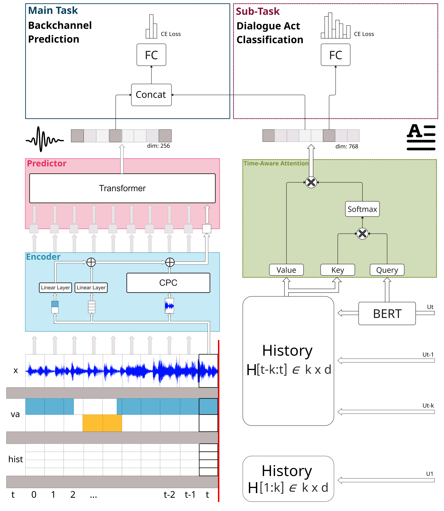

# BCDA



## Set Up

#### Step 0:
Create and activate a new clean conda environment:
```
>>> conda create -n myenv python=3.9
>>> conda activate myenv
```

#### Step 1:
In order to install the appropraite pytorch version, first find your CUDA version:
In Windows Powershell or Linux standard terminal:
```
>>> nvidia-smi
+-----------------------------------------------------------------------------+
| NVIDIA-SMI 515.65.01    Driver Version: 516.94       CUDA Version: **11.7**     |
|-------------------------------+----------------------+----------------------+
...
```

#### Step 2:
Find your matching pytorch version and copy the comand from:
https://pytorch.org/get-started/previous-versions/
There is no version for CUDA 11.7 listed, but we make use of backwards compatibility and install:
```
>>> conda install pytorch==1.12.1 torchvision==0.13.1 torchaudio==0.12.1 cudatoolkit=11.6 -c pytorch -c conda-forge
```

#### Step 3
Install all standard dependencies:
```
>>> pip install -r requirements.txt
```

#### Step 4:
Manually install the contrastive predictive wave encoding model:
```
>>> pip install git+https://github.com/facebookresearch/CPC_audio.git
```
The download may fail and ask you to install the C++ development tool with Visual Studio. Do so. Afterwards execute the above command again.
